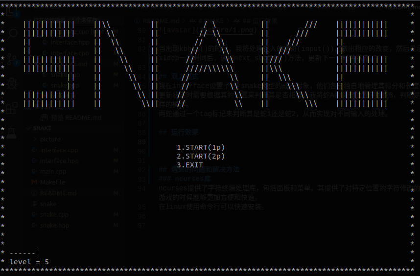
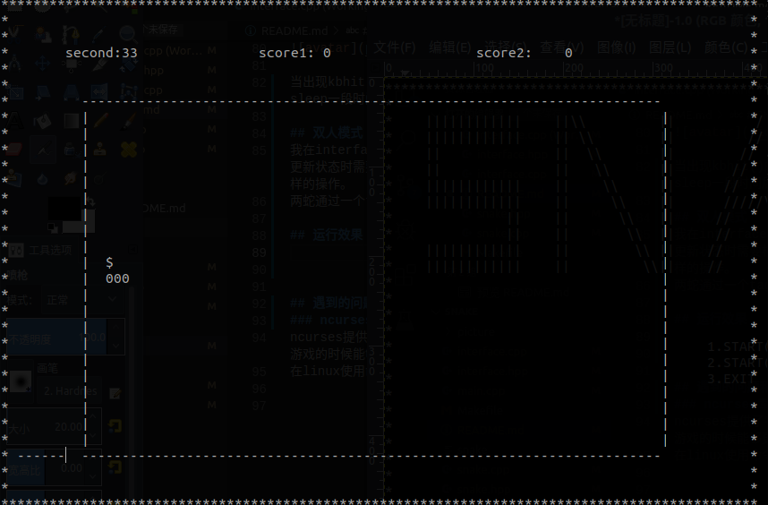
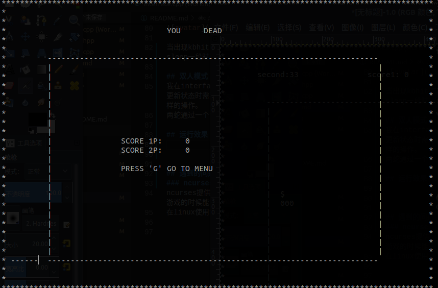

# SNAKE
161220151 许嘉帆
## 操作
|按键|功能说明|
|---|:---|
|w|上|
|s|下|
|a|左|
|d|右|
|i|上(2p)|
|k|下(2p)|
|j|左(2p)|
|l|右(2p)|
|g|选择|

## 编译
运行环境：Ubuntu18.04  
运行方法：
```
sudo apt-get install libncurses5-dev
make run LEVEL=5
```
先安装ncurses库，make run启动游戏

## 游戏功能说明
可以执行贪吃蛇游戏，四周是围墙，000代表蛇，$为普通食物，@为特殊食物，蛇每吃掉5个食物会产生一个特殊食物，特殊食物会在40步之后消失，越快吃到特殊食物可以获得越高的分数。蛇每吃掉一个食物会增长自身。

还有一种双人模式，能够同时支持2条蛇进行合作游戏，当其中任意一蛇死亡时游戏结束，两蛇相撞也会导致死亡。

## 类的设计
我主要设计了2个类，interface和snake，interface类主要负责游戏界面的管理绘画以及得分的管理。snake类主要负责贪吃蛇的状态更新以及绘画。snake类是interface类的成员对象。这样封装可以很容易地实现双人模式。
```
class interface{
private:
    int second;                     //当前游戏执行时间
    int show_state;                 //当前游戏所处的状态  有MENU，GAMING，DEAD3种
    int option;                     //menu中的选项
    int a_row;                      //当前食物所在行
    int a_col;                      //当前食物所在列
    bool special_flag;              //当前食物是否为特殊食物
    int special_count;              //特殊食物的倒计时
    int nom;                        //普通食物的技术，为特殊食物产生做准备
    snake Snake;                    //贪吃蛇
    snake Snake2;                   //贪吃蛇
public:
    interface();
    void show_begin();              //页面展示（更新整个页面）
    void show();                    //根据当前所处的状态修改某几个位置的字符
    void input(const char ch);      //对输入进行对应的判断
    void next_second();             //更新下一秒的状态
    bool new_food();                //生成新的食物
    void game_init();               //启动新游戏的准备，score清理，snake重新生成等。
};

class snake{
private:
    node* head;                     //贪吃蛇的头结点
    SNAKE_STATE state;              //贪吃蛇的运动状态
    int score;
    bool p1_p2;                     //true p1 false p2
public:
    snake(int i);
    node* get_head();               //获得头部    
    int get_score();                     //获得当前蛇的得分
    void add_score(int s);                     //增加当前蛇的得分
    void snake_init(int i);              //游戏开始时初始化蛇
    void next_second(bool flag);    //处理下一秒蛇的状态（包括运动和显示）true表示吃到了食物，false表示没吃到
    bool eat(int row,int col);      //处理蛇是否吃到row行，col列的食物
    void show();                    //在页面中打印当前蛇
    void input(char ch);            //处理输入，更改蛇的运动状态
    bool if_death();                //判断当前状态蛇是否死亡
    bool another_death(const node* const n);    //判断另一条蛇是否撞上该蛇
    void snake_destory();           //游戏结束时释放蛇身节点所占用的空间
    ~snake();
};

```
2个类的方法和变量我都写了注释，程序执行时，做完初始化的工作后，主要就是每隔一段时间执行interface的input，show，next_second三个方法。


当出现kbhit()的时候，我将处理输入的字符(input())，做出相应的改变，然后显示出来(show()),sleep一段时间后，调用next_second()方法，更新下一个时钟状态。

## 双人模式
我在interface设置了2个snake类型的成员对象，他们各自独自地管理其得分和长度位置等信息，同时在更新状态时需要根据其的位置来判断其是否相撞，我将蛇A的头部位置传给蛇B，判断是否相撞，蛇B也做同样的操作。  
两蛇通过一个tag标记来判断其是蛇1还是蛇2，从而实现对不同输入的处理。

## 运行效果
### menu

### gaming

### ending



## 遇到的问题和解决方法

### 控制台字符显示
在linux的终端中编写控制台小程序，如果使用cout和clear来实现帧的效果会产生明显的闪烁感，查阅资料我了解到ncurses库对控制台提供了许多优秀的封装好的库，于是我借助其来实现我的控制台贪吃蛇。
#### ncurses库
ncurses提供了字符终端处理库，包括面板和菜单。其提供了对特定位置的字符修改的功能，在执行控制台游戏的时候能够更加方便和快速。  
在linux使用命令行可以快速安装。

### kbhit()
kbhit()是一个C和C++函数，用于非阻塞地响应键盘输入事件。其中文可译为“键盘敲击”(keyboard hit)。  
在windows系统中有这个函数，这个函数可以用来实时地检测我的输入而不会导致程序的停顿等待输入。  
在linux中需要编写来实现该函数类似的功能。  
我参考了 https://blog.csdn.net/newyoung518/article/details/50120981 中的实现，可以在敲击键盘的时候返回一个1。然后我再从缓冲区中读取输入的字符，实现控制。

### 双蛇互撞时的判断
由于两条蛇的位置和身体信息是他们的私有变量，那么如何来判断其是否相撞呢？  
我的实现方法是将两蛇的头部互相传输后判断另一条蛇是否撞上该蛇。可能也可以使用友元的方法。