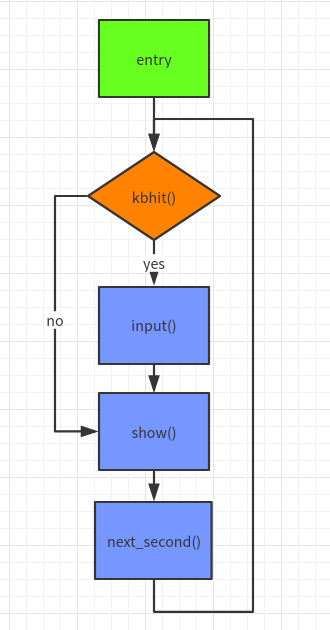

# SNAKE

## 操作
|按键|功能说明|
|---|:---|
|w|上|
|s|下|
|a|左|
|d|右|
|g|选择|

## 编译
运行环境：Linux  
运行方法：
```
sudo apt-get install libncurses5-dev
make run LEVEL=5
```
先安装ncurses库，make run启动游戏

## 游戏功能说明
可以执行贪吃蛇游戏，四周是围墙，000代表蛇，$为普通食物，@为特殊食物，蛇每吃掉5个食物会产生一个特殊食物，特殊食物会在40步之后消失，越快吃到特殊食物可以获得越高的分数。蛇每吃掉一个食物会增长自身。

## 类的设计
我主要设计了2个类，interface和snake，interface类主要负责游戏界面的管理绘画以及得分的管理。snake类主要负责贪吃蛇的状态更新以及绘画。
```
class interface{
private:
    int second;                     //当前游戏执行时间
    int show_state;                 //当前游戏所处的状态  有MENU，GAMING，DEAD3种
    int option;                     //menu中的选项
    int score;                      //当前游戏得分
    int a_row;                      //当前食物所在行
    int a_col;                      //当前食物所在列
    bool special_flag;              //当前食物是否为特殊食物
    int special_count;              //特殊食物的倒计时
    int nom;                        //普通食物的技术，为特殊食物产生做准备
    snake Snake;                    //贪吃蛇
public:
    interface();
    void show_begin();              //页面展示（更新整个页面）
    void show();                    //根据当前所处的状态修改某几个位置的字符
    void input(const char ch);      //对输入进行对应的判断
    void next_second();             //更新下一秒的状态
    bool new_food();                //生成新的食物
    void game_init();               //启动新游戏的准备，score清理，snake重新生成等。
};

class snake{
private:
    node* head;                     //贪吃蛇的头结点
    SNAKE_STATE state;              //贪吃蛇的运动状态
public:
    snake();    
    void snake_init();              //游戏开始时初始化蛇
    void next_second(bool flag);    //处理下一秒蛇的状态（包括运动和显示）true表示吃到了食物，false表示没吃到
    bool eat(int row,int col);      //处理蛇是否吃到row行，col列的食物
    void show();                    //在页面中打印当前蛇
    void input(char ch);            //处理输入，更改蛇的运动状态
    bool if_death();                //判断当前状态蛇是否死亡
    void snake_destory();           //游戏结束时释放蛇身节点所占用的空间
    ~snake();

};
```
2个类的方法和变量我都写了注释，程序执行时，做完初始化的工作后，主要就是每隔一段时间执行interface的input，show，next_second三个方法。



当出现kbhit()的时候，我将处理输入的字符(input())，做出相应的改变，然后显示出来(show()),sleep一段时间后，调用next_second()方法，处理下一个时钟状态。

## ncurses库
ncurses提供了字符终端处理库，包括面板和菜单。其提供了对特定位置的字符修改的功能，在执行控制台游戏的时候能够更加方便和快速。  
在linux使用命令行可以快速安装。

